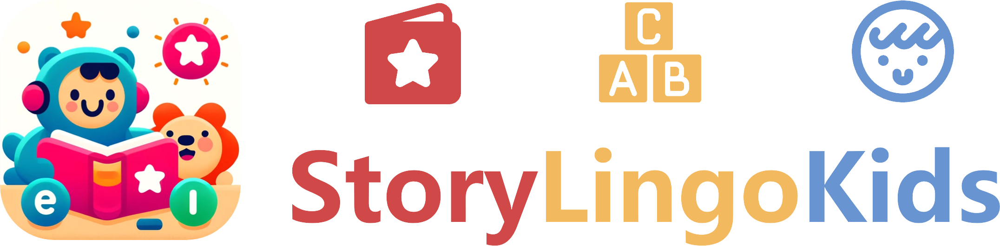

# Story Lingo Kids

> [!CAUTION]
> ### 免责声明 | Disclaimer
>
> The code and materials contained in this repository are intended for personal learning and research purposes only and may not be used for any commercial purposes. Other users who download or refer to the content of this repository must strictly adhere to the **principles of academic integrity** and must not use these materials for any form of homework submission or other actions that may violate academic honesty. I am not responsible for any direct or indirect consequences arising from the improper use of the contents of this repository. Please ensure that your actions comply with the regulations of your school or institution, as well as applicable laws and regulations, before using this content. If you have any questions, please contact me via [email](mailto:minmuslin@outlook.com).
>
> 本仓库包含的代码和资料仅用于个人学习和研究目的，不得用于任何商业用途。请其他用户在下载或参考本仓库内容时，严格遵守**学术诚信原则**，不得将这些资料用于任何形式的作业提交或其他可能违反学术诚信的行为。本人对因不恰当使用仓库内容导致的任何直接或间接后果不承担责任。请在使用前务必确保您的行为符合所在学校或机构的规定，以及适用的法律法规。如有任何问题，请通过[电子邮件](mailto:minmuslin@outlook.com)与我联系。

StoryLingoKids: Educational fun, AI-enabled interaction, leading the early childhood English learning experience.

StoryLingoKids：寓教于乐、AI 智能交互、引领幼儿英语启蒙教育体验。

> ***Relevant course***
> * Human Computer Interface 2024 (2024 年同济大学用户交互技术)

## 仓库组成

* [StoryLingoKids](storylingokids)
项目源代码

* [Final Defense](Final_Defense.pptx)
结题答辩

* [Opening Defense](Opening_Defense.pptx)
开题答辩

* [StoryLingoKids Documentation](StoryLingoKids_Documentation.md)
StoryLingoKids 项目文档
