# StoryLingoKids Documentation

> StoryLingoKids: Educational fun, AI-enabled interaction, leading the early childhood English learning experience.
>
> StoryLingoKids：寓教于乐、AI 智能交互、引领幼儿英语启蒙教育体验。
>
> 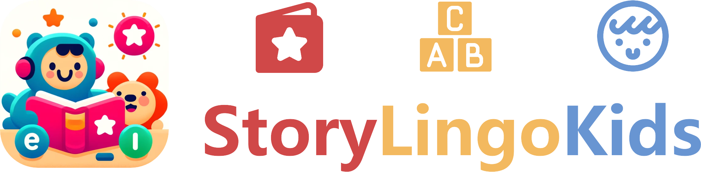

[TOC]

## 1 项目概述

### 1.1 项目背景

#### 1.1.1 社会背景

近年来，早期教育行业逐渐成为家长们关注的焦点。随着全球化进程的加快和社会对英语能力需求的增加，幼儿英语教育的重要性日益凸显。家长们普遍希望孩子能够从小接受良好的英语教育，以便在未来的学术和职业生涯中占据优势。然而，传统的幼儿英语教育存在诸多挑战：

1. **师资力量不足**：优秀的幼儿英语教师资源稀缺，无法满足市场的巨大需求。
2. **教育资源不均衡**：城乡之间教育资源分布不均，部分地区的孩子难以接触到优质的英语教育资源。
3. **教学方法单一**：传统的教学方法往往枯燥乏味，难以激发孩子的学习兴趣和主动性。

#### 1.1.2 创意来源与价值实现

StoryLingoKids 是一款创新型的幼儿英语教育软件，旨在通过 AI 交互技术，提供个性化、互动性强的英语学习体验。其创意来源于以下几点：

1. **科学研究**：研究表明，幼儿时期是语言学习的关键期。在这一阶段，孩子的大脑对语言输入异常敏感，适当的语言环境和互动能够显著提高语言学习效果。
2. **实际需求**：当前市场上缺乏一款既能提供高质量英语教学内容，又能通过有趣的互动激发孩子学习兴趣的产品。StoryLingoKids 正是基于这一市场空白开发的。
3. **技术发展**：随着 AI 技术的成熟，智能语音识别、自然语言处理等技术已经能够为幼儿英语教育提供强有力的支持。StoryLingoKids 充分利用这些技术，打造了一款智能化的英语学习工具。

StoryLingoKids 的社会价值在于，通过创新的教育方法和先进的技术手段，为幼儿提供优质的英语教育服务，帮助他们在语言学习的黄金期打下坚实的基础。同时，通过丰富多彩的互动内容和个性化的学习路径，激发孩子的学习兴趣，让英语学习变得轻松有趣。此外，StoryLingoKids 还特别考虑到了现代家长的时间和专业资源限制，旨在为他们提供一个既方便又高效的幼儿英语教育解决方案。

### 1.2 项目目标

1. **创新互动方法**：应用程序结合了讲故事和游戏元素，创建了一个情境学习环境，让孩子在故事情节中自然学习英语。这种方法不仅使学习变得更加有趣，还增强了对教育内容的吸收和理解。
2. **智能语音互动**：利用先进的语音识别技术，孩子可以通过与应用程序对话来练习英语口语。这种互动模式使学习更加动态和有吸引力，同时提供即时的发音纠正和实时反馈，大大提高了学习效率。
3. **个性化学习路径**：应用程序的算法可以根据每个孩子的进步和兴趣定制学习路径。通过分析孩子的互动和学习行为，系统可以提供适合其学习水平和偏好的内容，确保每个孩子都能以自己的节奏学习，从而最大限度地提高学习效果。

## 2 市场分析

### 2.1 市场背景

1. **早期英语启蒙**：研究显示，儿童在四至五岁时开始接触新语言最为有效，这一时期的语言学习对他们的长期语言技能发展尤为关键。然而，市场上针对这一特定年龄段的英语启蒙应用非常有限。
2. **认知与学习特点**：四五岁的幼儿处于认知发展的关键阶段，需要通过游戏和互动活动进行学习，而市场上许多应用的设计过于复杂，不符合这一年龄段幼儿的学习和操作习惯。

### 2.2 行业痛点

1. **家长和孩子的双重需求难以满足**：早教产品和服务需要同时吸引孩子和满足家长的审美及教育价值观。这种双向需求常常难以平衡，导致产品难以获得广泛的市场接受。
2. **社会对早教的认知偏差**：许多家长对早教的理解还停留在传统的学前教育阶段，认为早教主要是学习基础学科知识如英语、识字和数学，而忽略了早教更为重要的是促进儿童的全面发展，包括情感、人格和精神层面的成长。
3. **早教机构模式的局限性**：当前的早教机构多采用引进的外国课程体系，这不仅可能与中国本土的文化和教育方式不充分吻合，而且可能导致家长参与的门槛提高，特别是那些英语能力较弱的家长可能感到被排斥。
4. **家长的参与度不足**：由于对早教的误解和教育机构服务模式的限制，家长往往不能或不愿意深入参与孩子的早教过程。这种缺乏参与导致教育效果不佳，孩子可能出现厌学情绪，而家长也因此对早教产生失望。

### 2.3 市场需求与潜力

#### 2.3.1 市场需求

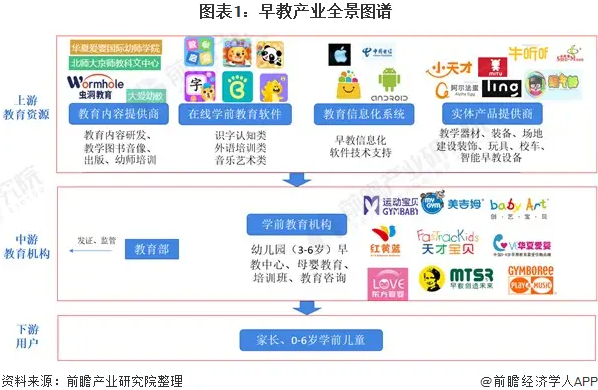

1. **互动性和娱乐化学习工具**：家长和教育机构都在寻找能够结合娱乐和教育的学习工具，帮助孩子在享受游戏的同时学习英语。这种需求推动了寓教于乐的教育产品的开发。
2. **家长参与**：现代家长愈发关注孩子的早期教育，特别是语言学习，他们希望能够积极参与并监控孩子的学习进度，故寻求能提供这些功能的教育软件。
3. **个性化和适应性学习**：每个孩子的学习速度和兴趣都不同，市场上对能够根据个体差异调整学习内容和难度的智能教育软件的需求正在增长。
4. **多平台可访问性**：随着智能设备的普及，家长和教育机构需要能够在多种设备上运行的软件，包括智能手机、平板电脑和电脑，以便孩子随时随地学习。
5. **文化相关和语言适应性内容**：适合本地文化和语言环境的教育内容更能吸引家长和孩子，帮助孩子更容易理解和接受新知识。

#### 2.3.2 市场潜力

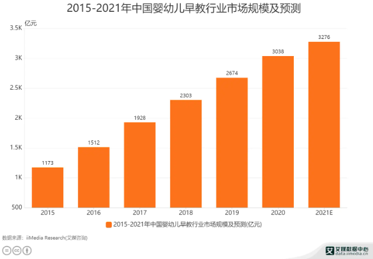

1. **庞大的目标用户群体**：中国有超过 2 亿的 0 至 6 岁儿童，其中大部分家庭都重视早期教育，特别是英语学习，为早教软件提供了庞大的潜在用户基础。
2. **政策支持**：政府对教育行业特别是早教的重视和投资持续增加，新政策和资金的投入为早教市场提供了发展的机遇。
3. **技术发展**：随着 AI 和机器学习技术的发展，能够提供更加智能化和个性化学习体验的教育软件正成为市场趋势。
4. **国际化趋势**：随着全球化加深，越来越多的中国家庭意识到英语学习的重要性，为英语启蒙教育软件提供了持续的市场需求。

### 2.4 竞争分析

#### 2.4.1 竞争环境

一些已经在市场上占据领导地位的教育软件，提供全面的课程内容和先进的学习技术。中国市场上也有许多本土的英语教育应用，如宝宝巴士、启蒙英语等，这些应用往往有更大的用户基数。

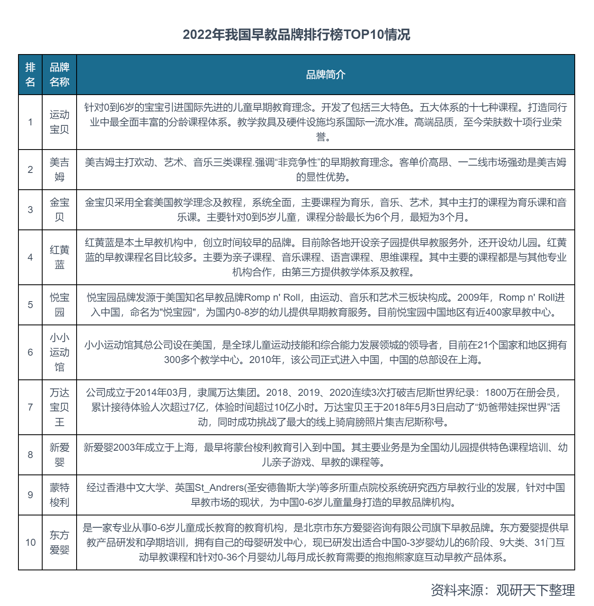

#### 2.4.2 竞品分析

1. **宝宝巴士**：宝宝巴士是一个广受欢迎的面向幼儿的教育应用程序，它提供多种早教内容，包括语言学习、数学基础、艺术创造等。以下是对宝宝巴士的优势和劣势的分析：
   * **优势**：
     * **广泛的课程内容**：宝宝巴士提供多样化的教育内容，涵盖了幼儿教育的各个方面。这种全面性满足了不同孩子的兴趣和学习需求。
     * **强大的用户基础**：宝宝巴士在全球范围内拥有庞大的用户群，这为其带来了强大的品牌认知度和市场影响力。
     * **互动性和娱乐性**：应用设计了许多互动游戏和活动，使学习过程变得有趣，能够有效地吸引孩子的注意力和兴趣。
   * **劣势**：
     * **内容的深度与系统性**：尽管宝宝巴士提供广泛的内容，但在某些教育领域（如语言学习）可能缺乏足够的深度和系统性，这可能不利于孩子们系统地掌握某一领域的知识。
     * **教育方法的一致性**：宝宝巴士的教育方法可能在不同的游戏和活动之间缺乏一致性，这可能会导致孩子在学习过程中的混淆。
     * **广告和内购**：宝宝巴士应用中包含广告和内购，这可能会干扰孩子的学习过程，同时也可能成为家长对于使用该应用的顾虑。
     * **文化适应性**：虽然宝宝巴士试图适应不同文化背景的用户，但其内容可能仍然偏重于某一文化，对于其他文化背景的孩子可能不够吸引或者难以完全理解。

2. **Peekaboo Barn**：Peekaboo Barn是一款旨在帮助幼儿学习农场动物及其叫声的互动式教育应用程序。它特别适合幼儿阶段的孩子，通过游戏化元素提供有趣的学习体验。
   * **优势**：
     * **简单直观的界面**：Peekaboo Barn 专为幼儿设计，界面简单，操作易懂。这使得即使是年龄较小的孩子也能轻松使用，无需家长持续监督。
     * **吸引幼儿的视觉和声音设计**：该应用使用鲜明的颜色和可爱的动物图像，结合动物的叫声，有效地吸引幼儿的注意力，增强他们的视听学习体验。
     * **多语言支持**：Peekaboo Barn 支持多种语言，这不仅帮助孩子学习动物名称，还能在一定程度上提早接触和学习新语言，如英语，这对非英语母语的幼儿尤其有益。
     * **文化多样性和包容性**：应用中包括多种文化背景下的动物，有助于幼儿了解和接受不同文化的元素，促进多元文化教育。
   * **劣势**：
     * **教育内容的局限性**：Peekaboo Barn 主要集中在动物及其叫声上，教育内容相对单一，可能不足以支持更广泛或更深入的学习需求。
     * **缺乏学习深度和挑战**：对于求知欲较强或稍大一些的幼儿，Peekaboo Barn 可能缺乏足够的学习深度和挑战性，难以长期维持孩子的兴趣。
     * **互动性有限**：虽然应用的基本互动性对于幼儿来说是友好的，但其互动性相对较低，主要限于基本的触摸和响应，可能不足以充分发展孩子的操作技能或解决问题能力。
     * **扩展性不足**：应用在内容和功能上的扩展性有限，随着孩子年龄的增长，可能很快就不再适用。

## 3 需求分析

### 3.1 角色设定

| Photo |  |  |  |
| :---: | :---: | :---: | :---: |
| Name | Mary | Sophia | Linda |
| Age | 4 | 29 | 34 |
| Status | Kid | Mother | Teacher |
| Description | 喜欢动画和音乐，注意力持续时间较短，正在学习基础语言和认知技能。 | 关心孩子的早教问题，但又工作繁忙，希望有效利用时间来教育和陪伴孩子。 | 在幼儿园工作，负责多个孩子的教育，重视教育效果，希望有办法能够提高教学效率。 |
| Demand | 视觉刺激：互动动画和色彩鲜明的图形；声音反馈：每个动作或选择都有声音响应。 | 教育资源：不花太多时间和成本就可以获得孩子的早教教育资源，并能吸引孩子主动学习。 | 寻求一种寓教于乐的教学方式，提高对幼儿的教学效率。 |

### 3.2 目标用户分析

#### 3.2.1 用户特性

StoryLingoKids 主要面向的是 3 至 6 岁的幼儿。这个年龄段的孩子具有以下特征：

* **认知发展**：处于语言和认知技能快速发展的阶段，能够接受简单的指令和参与基本的对话。
* **注意力**：注意力集中时间较短，需要频繁变换活动来维持兴趣。
* **操作能力**：手眼协调正在发展中，对于复杂的操作可能感到困难，适合简单直观的交互界面。
* **学习方式**：通过游戏和故事等互动活动学习效果最好，能够在玩乐中学习新知识和技能。

#### 3.2.2 核心需求

* **教育需求**：
  * 家长和教育者希望通过一个寓教于乐的工具来促进儿童的语言能力和社交技能的发展。他们倾向于选择能够提供多样化、教育性强的内容，帮助孩子在家里和学前教育机构中学习基础词汇和语言结构。
* **交互需求**：
  * 需要一个有吸引力且操作简单的用户界面，以适应幼儿的认知水平和操作技能。界面设计需要大图标、鲜艳的颜色和简洁的导航。
  * 产品应支持触摸屏操作，考虑到幼儿的动作精确度，交互设计应避免需要精细操作的元素。

### 3.3 应用场景分析

#### 3.3.1 主要使用环境

* **家庭**：
  * **用户组成**：家长需求，主要是 3 至 6 岁幼儿。
  * **需求特点**：需要提供多种互动模式，如共读故事、点击拼读等，以促进孩子的学习参与感，增加互动的乐趣和教育价值。
  * **技术需求**：操作简单，界面友好，能够让孩子轻松了解和参与学习。
* **学前教育机构**：
  * **用户组成**：教师需求，多个儿童共同使用，强调教育性。
  * **需求特点**：提供给教师更利于孩子学习拼读的工具，如点读方式。
  * **技术需求**：操作简单，界面友好，能够让孩子轻松了解和参与学习。

#### 3.3.2 场景需求特点

* **互动与参与**：
  * 在家庭或学前教育机构中，StoryLingoKids 需要设计鼓励主动学习和参与的活动，这些活动应该能够适应不同年龄段的儿童，同时支持单独和互动的灵活性。
* **教育与娱乐的融合**：
  * 应用应平衡教育内容和娱乐元素，确保学习活动既能吸引儿童的兴趣，又能实现教育目标。例如，通过游戏化的学习任务和有奖励的互动挑战，提高儿童的学习动机。
* **界面与操作设计**：
  * 考虑到幼儿的年龄和操作技能，界面设计需要简洁明了，避免复杂的菜单或多层次的导航。图标和按钮应大而明显，确保儿童能够容易识别和操作。

## 4 低保真原型设计

### 4.1 功能流程设计

#### 4.1.1 首页功能区

**主要功能区**：

* **ABC**：点击后进入一个专门的学习页面，页面中展示了 26 个英文字母。每个字母都设计有一个互动按钮，孩子点击后可以听到字母的发音，并通过动画或小游戏加深记忆。
* **123**：此部分通过有趣的视觉和音效引导孩子学习数字 1 至 10。每个数字配有互动式触摸功能，点击后可以展示该数字的发音，例如“One”。
* **Colors**：颜色学习页面通过色块展示基本颜色，点击任一色块，屏幕会展示该颜色，如“Red”，同时播放颜色的发音，帮助孩子关联颜色和日常物品。
* **Shapes**: 学习常见的基本形状如圆形、正方形、三角形等。每种形状通过点击播放 Shapes 的发音，如“Circle”。
* **Animals**: 介绍常见的动物，每个动物提供一个互动按钮，孩子点击可以听到动物的名字和典型的叫声。
* **Birds**: 类似于动物类别，但专注于各种鸟类。每种鸟类展示其图片和叫声。
* **Stories**: 提供一系列以动物、鸟类或日常生活为主题的互动故事。每个故事都设计有教育性质的内容，例如教孩子认识字母或数数。

#### 4.1.2 学习与语音交互区

1. **字母学习页面**：
   * 孩子可以滑动屏幕浏览所有字母。
   * 选择任一字母后，播放字母的标准发音。
   * 认识字母后，可以点击麦克风按钮进入语音互动模式，孩子们可以通过正确拼读英语单词来获得对应的反馈，同时屏幕还会显示孩子的朗读内容。
2. **数字学习页面**：
   * 数字以引人注目的布局展示，每点击一个数字，播放该数字的标准发音。
   * 认识数字后，可以点击麦克风按钮进入语音互动模式，孩子们可以通过正确拼读英语单词来获得对应的反馈，同时屏幕还会显示孩子的朗读内容。
3. **颜色学习页面**：
   * 每个颜色块点击后，会播放该颜色的标准发音。
   * 认识颜色后，可以点击麦克风按钮进入语音互动模式，孩子们可以通过正确拼读英语单词来获得对应的反馈，同时屏幕还会显示孩子的朗读内容。
4. **形状学习界面**：
   * 形状通过可触摸的图块展示，触摸后拼读展示该形状，如“Cirlce”。
   * 认识形状后，可以点击麦克风按钮进入语音互动模式，孩子们可以通过正确拼读英语单词来获得对应的反馈，同时屏幕还会显示孩子的朗读内容。
5. **动物学习界面**：
   * 动物界面通过分类展示（如家畜、野生动物、水生动物），点击每个动物可以听到该动物的叫声和英文发音。
   * 认识动物后，可以点击麦克风按钮进入语音互动模式，孩子们可以通过正确拼读英语单词来获得对应的反馈，同时屏幕还会显示孩子的朗读内容。
6. **鸟类学习界面**：
   * 鸟类通过滚动界面展示，每种鸟类都有对应的声音。
   * 认识鸟类后，可以点击麦克风按钮进入语音互动模式，孩子们可以通过正确拼读英语单词来获得对应的反馈，同时屏幕还会显示孩子的朗读内容。
7. **故事界面**：
   * 提供多种故事选择，每个故事都有互动元素，鼓励孩子在阅读的同时参与和思考。

#### 4.1.3 故事绘本区

1. **故事选择界面**：
   * 提供多个故事选项，每个故事都以一个卡片形式展示，卡片上有故事的标题和一个引人注意的图像。
   * 故事内容涵盖字母、数字和颜色的学习，确保教育内容的多样性和丰富性。
2. **故事阅读界面**：
   * 每个故事分为多页，每页有简单的文本和相应的互动图像。
   * 故事中包括选择题或填空题等互动元素，孩子需要互动才能继续阅读，从而加深理解和参与感。

### 4.2 关键任务执行路径

1. **进入首页**：
   * **界面**：展示不同的教育模块。
   * **操作**：滑动屏幕浏览所有模块。
2. **选择特定学习模块**：
   * **操作示例**：对“形状”感兴趣，点击“形状”模块按钮。
3. **进入学习界面**：
   * **界面**：显示不同的基本形状图标（圆形、正方形、三角形等）。
   * **操作**：点击其中一个形状，例如“圆形”。
4. **互动学习（以 Shapes 模块 Circle 为例）**：
   * **操作**：点击麦克风，选择 Circle 图案，读出“Circle”。
   * **反馈**：语音结束后，屏幕显示拼读正确程度反馈，并打印收听到的内容。
5. **完成学习并返回**：
   * **操作**：学习完成后，点击“返回”按钮，返回到主学习模块选择界面。
6. **选择并阅读故事**：
   * **操作**：从主界面选择“故事”模块。
   * **界面**：展示不同的故事选项卡片。
   * **操作**：用户选择一个故事，例如“Big A and Little a”。
7. **故事互动阅读**：
   * **界面**：故事以页的形式展示，每页包含文本和相关的互动图像。
   * **操作**：阅读故事的同时，跟随每页的语音音效学习。
8. **完成故事并返回或继续**：
   * **操作**：故事结束后，可以选择“重复”或者“下一个”继续另一个故事，或点击“返回”回到故事选择界面。
9. **退出应用**：
   * **操作**：随时可以点击任何页面上方的“退出”按钮，退出应用。

### 4.3 低保真卡片用例模型

#### 4.3.1 首页功能区

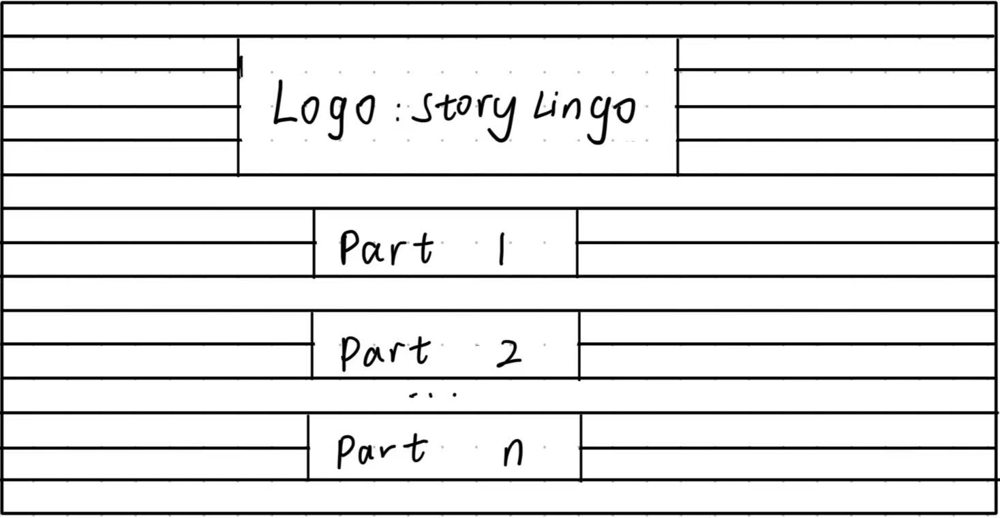

#### 4.3.2 学习与语音交互区

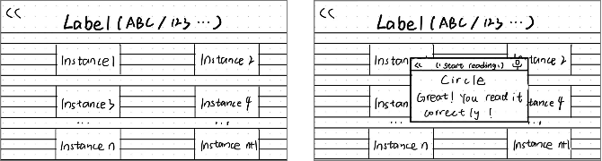

#### 4.3.3 故事绘本区

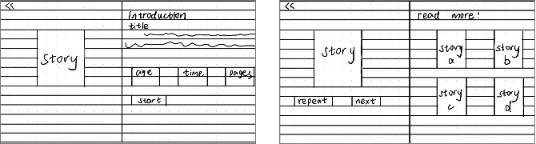

## 5 高保真原型设计

### 5.1 交互设计理念

1. **以幼儿为中心的设计**：我们深入研究了幼儿的认知发展阶段和学习需求，确保应用设计对这一年龄段的用户友好且引人入胜。设计每一个元素之前，我们都从幼儿的视角出发，确保操作简单直观，内容易于理解和使用。
2. **强化多感官学习体验**：幼儿在这个年龄阶段对多感官的感知较强，因此我们的应用设计包含丰富的视觉、听觉和触觉反馈。例如，通过可爱的动画、愉悦的音效和适当的触觉反馈（如震动），帮助幼儿更好地理解他们的操作并增强学习体验。
3. **创建互动和参与感**：交互设计不仅要有趣，还要能够激发幼儿的好奇心和探索欲。我们通过引入互动音效、故事讲述等元素，让孩子们在参与的过程中主动学习，而不是被动接受知识。
4. **简化设计避免认知负担**：在设计界面和功能时，我们尽量保持简洁，避免过多复杂的操作和界面元素，减少幼儿在使用过程中可能遇到的困惑。应用中的文字使用极为有限，更多信息通过直观的图形和符号传达。
5. **整合教育与娱乐**：教育应用的成功在于能够将学习与娱乐完美结合。StoryLingoKids 旨在通过吸引孩子们的游戏和活动，自然地传授英语知识，使学习过程成为一种乐趣。

### 5.2 交互设计特点

1. **界面设计和操作流程**：
   * **简洁直观的界面**：我们的界面设计专为 3 至 6 岁幼儿认知能力量身定制，采用简单明了的视觉元素，功能布局清晰有序，极大地减少了文字的使用，而是通过直观的图形和图标来展示功能，使得即使是尚未掌握阅读技能的幼儿也能自主导航和操作。
   * **友好的操作流程**：操作流程简单直观，通过大按钮和滑动等幼儿易于理解和执行的动作进行交互，确保幼儿能够轻松地使用应用进行学习。
2. **交互反馈**：
   为了让幼儿在使用应用时获得即时且明确的反馈，我们设计了以下几种反馈机制：
   * **触觉反馈**：在幼儿触碰屏幕按钮后，应用提供轻微的震动反馈，增强交互的实感。
   * **声音反馈**：每个操作，无论是进入新页面还是返回前一个页面，都有独特的背景提示音，帮助幼儿通过听觉确认他们的操作。
   * **视觉反馈**：切换页面时会有流畅的动画效果，长按录音或其他功能操作时，按钮颜色加深，具备明确的设计视觉反馈。
3. **美观风格与素材设计**：
   * **统一的美观风格**：整个应用的美术风格统一且富有吸引力，采用可爱的插画和动画，以及易于阅读的字体设计，所有这些都是为了吸引幼儿的注意力，同时也符合他们的认知特点。
   * **专心选取的教学素材**：我们精选高质量的英语音频素材，确保每个单词和短语的发音清晰准确，适合幼儿学习英语发音。
4. **配色和视觉引导**：
   * **精心选择的配色**：应用中的配色方案经过精心选择，不仅美观而且符合幼儿的视觉喜好和认知特点，使用了温暖而柔和的色调，有助于创造一个舒适的学习环境。

这些用户交互设计的理念和实践确保 StoryLingoKids 能够提供一个既教育又娱乐的环境，以适配 3 至 6 岁幼儿的英语启蒙阶段，帮助他们无障碍自然地学习英语。

### 5.3 交互设计优势

1. **增强的学习吸引力**：通过将学习内容与互动元素（如动画、游戏、音效）相结合，StoryLingoKids 成功地将教育内容变得更加吸引人。这种设计不仅使得幼儿愿意花更多时间在应用上，还通过趣味性强的互动活动增加了学习的深度，使得学习效果更为持久。
2. **直观的操作界面**：考虑到幼儿的操作能力和认知水平，StoryLingoKids 的用户界面设计简单直观，大量使用直观的图标和图形，几乎不依赖文字指令。这样的设计降低了使用门槛，使得即使是首次接触智能设备的幼儿也能轻松上手。
3. **即时反馈机制**：应用中的每一个操作都伴随着视觉、听觉或触觉反馈，这不仅确认了幼儿的操作，还通过积极的反馈增强了他们的学习动机。例如，正确操作后的动画和声音奖励可以让幼儿感受到成就，激励他们继续学习和探索。
4. **健康系统设计**：考虑到幼儿的年龄特点，StoryLingoKids 特别强调应用的安全性。应用内没有第三方广告或不适宜的内容，确保幼儿在一个安全的环境下学习，家长放心。

### 5.4 高保真原型设计

#### 5.4.1 启动页面

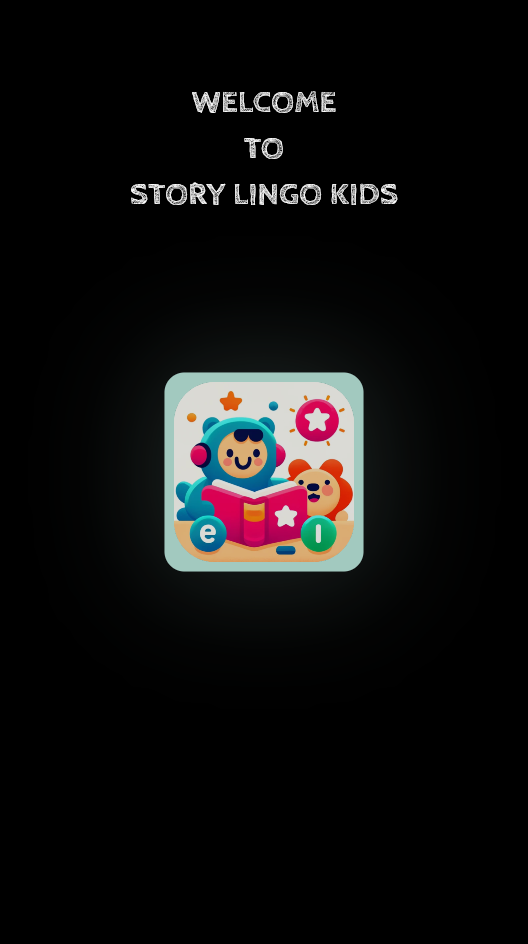

启动页面背景为黑色，显示 StoryLingoKids 的 Logo 和欢迎提示文字（Welcome to StoryLingoKids），提供了友好的启动提示，并通过流畅的动态切换动画进入首页功能区。

#### 5.4.2 首页功能区

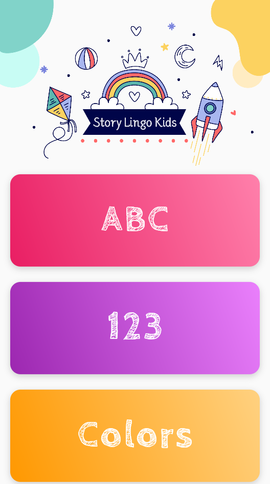

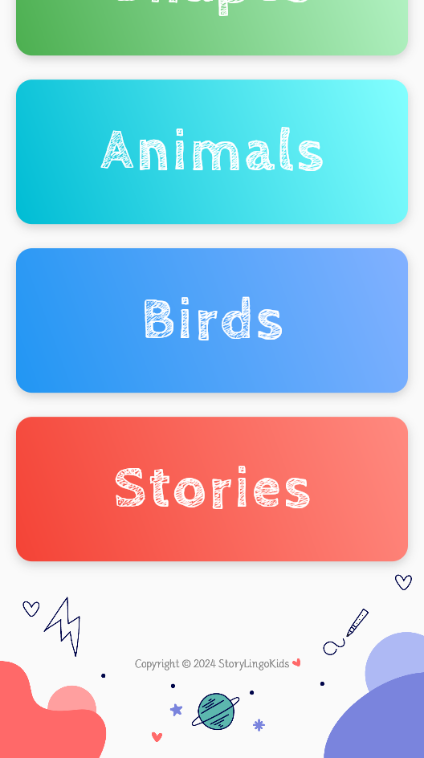

首页背景为白色，配以彩色的波浪形图案和星星、火箭等装饰图案，营造出梦幻和探索的氛围。每个按钮使用一种鲜明的颜色，并且带有代表模块内容的白色描线字体。按钮设计成易于点击的大尺寸，方便小孩操作。

#### 5.4.3 学习与语音交互区

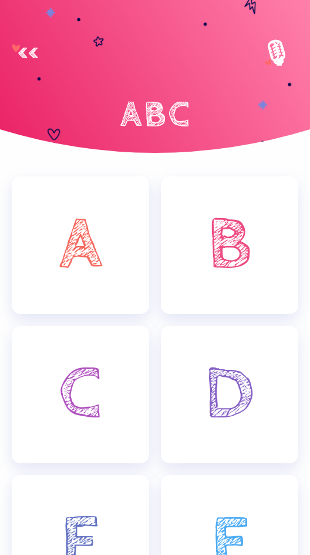

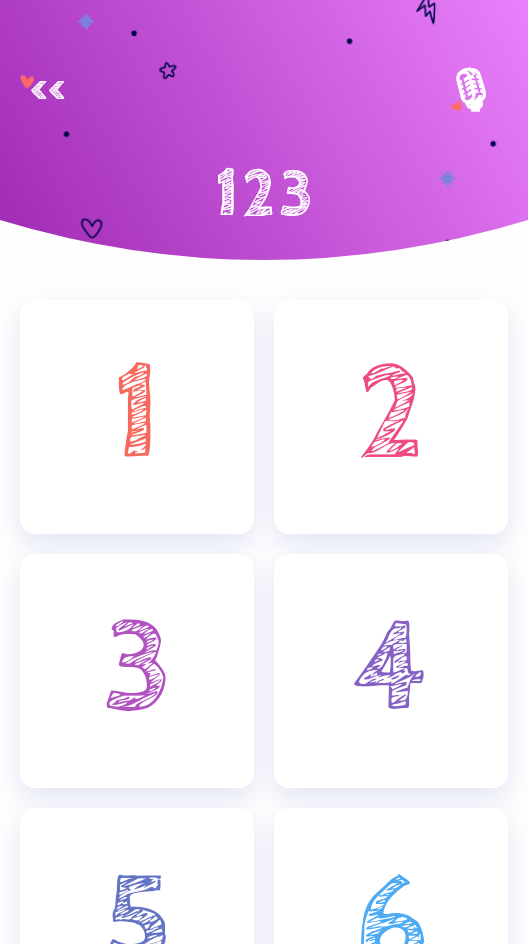

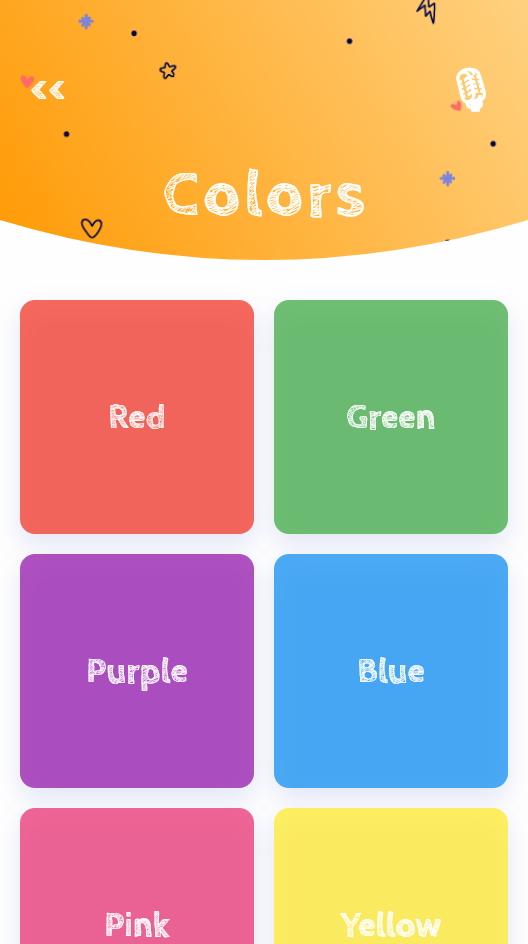

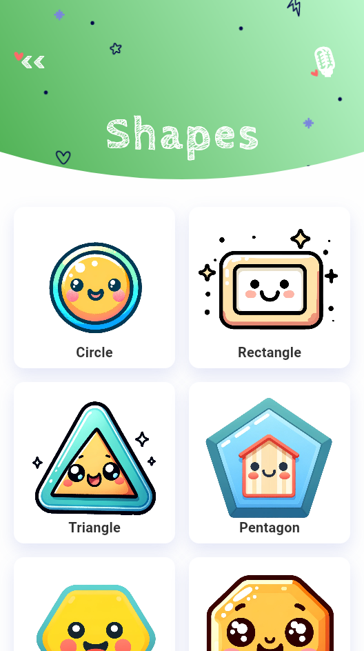

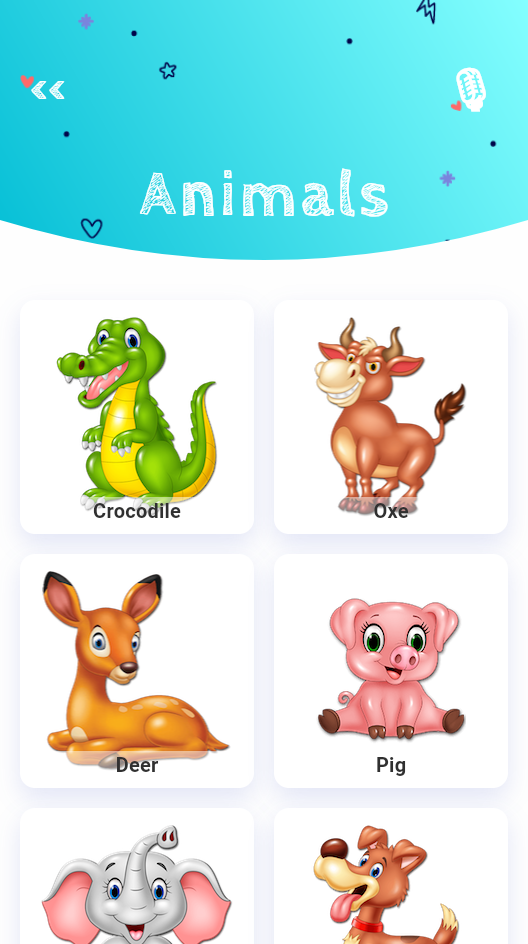

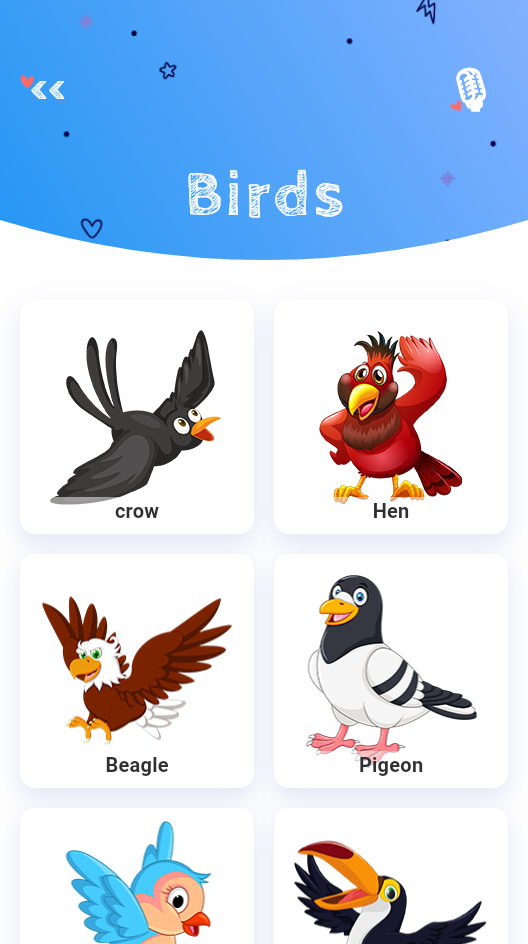

显示一系列实例卡片，背景色为柔和的颜色，每个卡片使用不同的淡色调，便于区分。每种卡片实例以有趣的描线风格呈现，简洁明了。卡片间隔均匀，确保触摸时不会误操作。

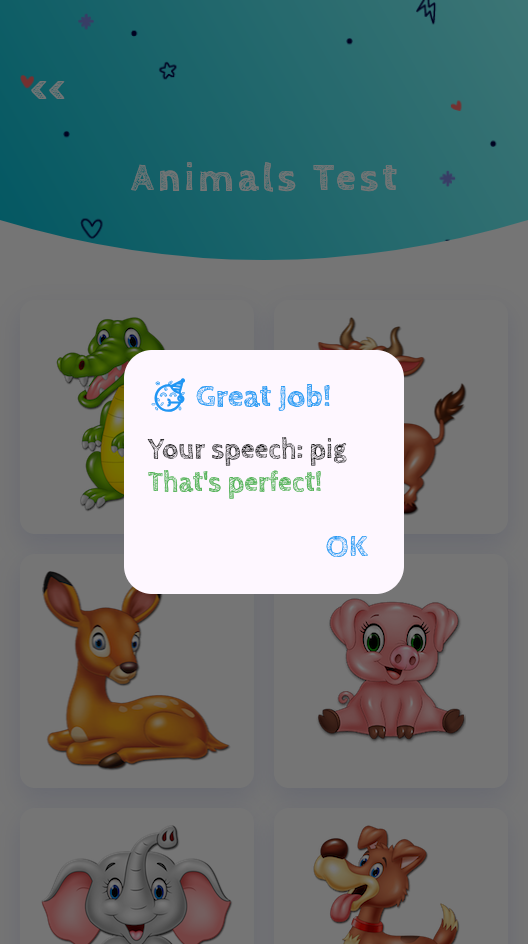

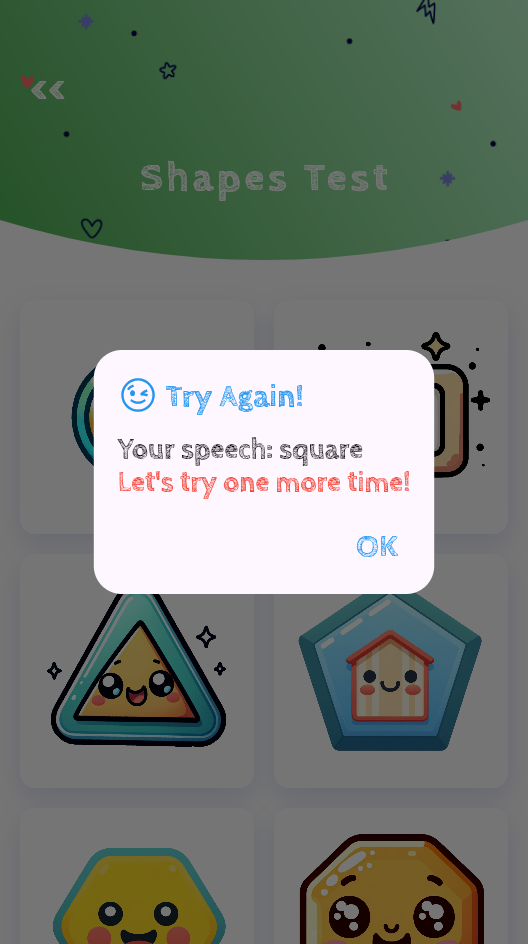

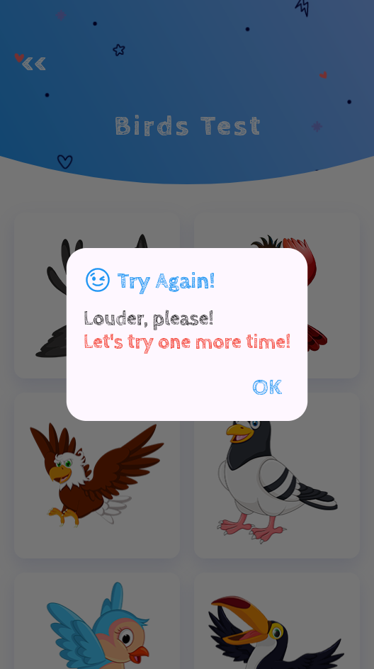

在语音界面设计中，幼儿将通过麦克风图标切换语音模式，我们采用了友好的视觉和文字提示，如图中的微笑表情符号和鼓励性文字（"Try Again! Louder, please! Let's try one more time!"），来引导幼儿进行交互。这种设计不仅帮助孩子理解他们需要做什么，还通过正面的反馈和明确的指示，增强了学习的动力和乐趣，使界面变得更加亲和且易于使用。

#### 5.4.4 故事绘本区

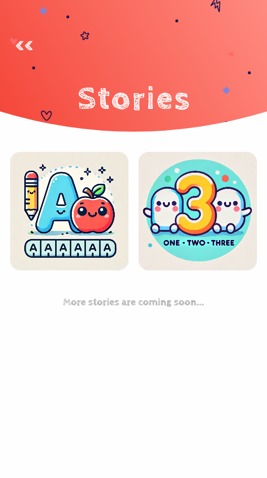

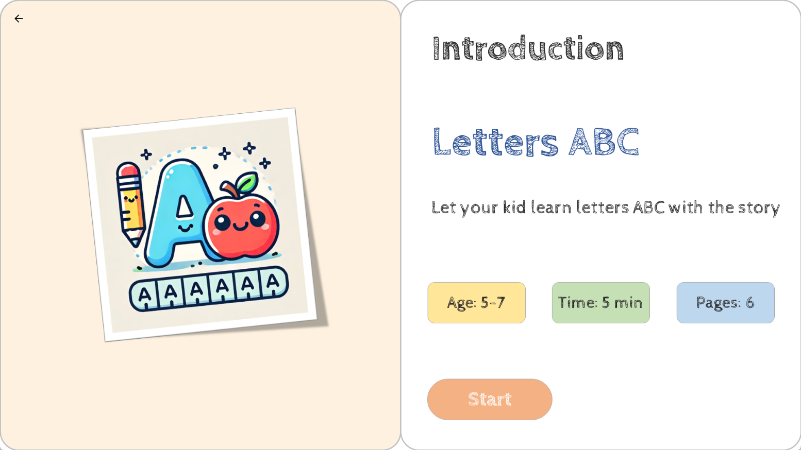

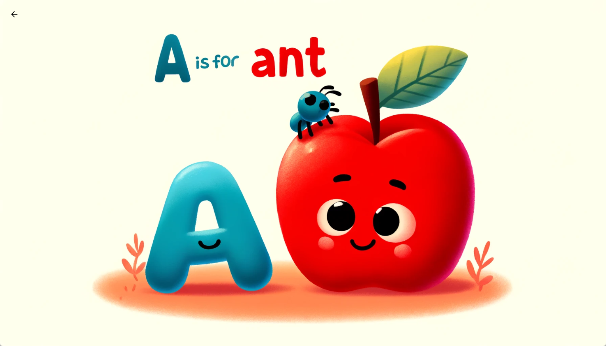

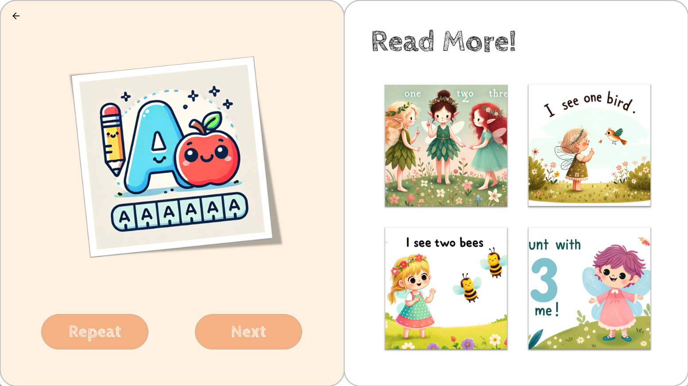

每个故事绘本选择以卡片形式展示，卡片上有故事的主题图像和标题，背景使用橘色调，吸引孩子的兴趣。故事内容页面设计简洁，主要以图文形式呈现，每一页都有精心准备的配音，帮助幼儿在视觉和听觉中加深记忆。结束时底部有“重复”和“下一个”等控制按钮，按钮大小适中，易于点击。

## 6 技术选型与实现

### 6.1 技术选型

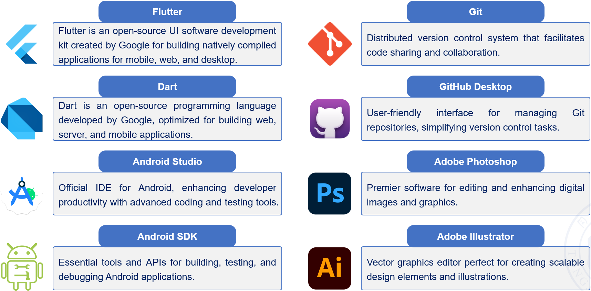

#### 6.1.1 Flutter

Flutter 是一个由 Google 开发的开源框架，允许一次代码编写，多平台部署（iOS, Android, Web等），大幅提高了开发效率。通过使用 Flutter，可以快速构建美观的用户界面，并且保证了在不同平台间的一致性和性能。

#### 6.1.2 Dart

Dart 是 Flutter 的官方编程语言，支持 JIT 和 AOT 编译，使得开发过程中可以快速迭代，同时发布的应用又能高效运行。选择 Dart 是为了与 Flutter 的兼容性和高效能，同时利用 Dart 的现代语言特性，如异步编程和强类型系统。

#### 6.1.3 Android Studio

Android Studio 是官方推荐的 Android 开发环境，集成了代码编辑、调试、性能测试和版本管理等多种功能。提供了强大的开发工具支持，特别是对 Flutter 应用的开发有着良好的集成支持。

#### 6.1.4 Android SDK

提供了开发 Android 应用所需的 API 库和开发工具，确保应用与 Android 操作系统的兼容。为 Flutter 应用提供 Android 平台特有的 API 访问，使应用能够利用平台特定功能。

#### 6.1.5 Git

Git 是一个广泛使用的版本控制系统，支持分布式版本控制，功能强大，适合团队协作。通过 Git，可以有效管理项目版本，支持多人协作开发。

#### 6.1.6 GitHub Desktop

GitHub Desktop 提供了 Git 的图形界面，使版本控制的操作更加直观易懂。其使得版本控制更加用户友好，便于管理和提交代码，特别是对不熟悉命令行操作的开发者更为友好。

#### 6.1.7 Adobe Photoshop

强大的图像编辑工具，广泛用于图形设计、照片编辑和复杂的图形创作。用于创建和编辑应用的视觉元素和用户界面设计，保证应用的视觉效果符合设计要求。

#### 6.1.8 Adobe Illustrator

是一个专业的矢量图形编辑工具，适合创建图标、插图、图表等。用于设计高质量的矢量图形界面元素，确保应用界面在不同屏幕尺寸上的清晰度和适应性。

### 6.2 项目技术架构

本项目遵循了清晰的 MVC（模型-视图-控制器）模式，适用于复杂的界面和数据处理需求。这里是该项目的技术架构的概要：

#### 6.2.1 Models（模型）

存放在 `models` 文件夹中，例如 `alphabets_model.dart` 、 `animals_and_birds_model.dart` 等。这些模型文件负责处理数据逻辑和业务逻辑，是应用程序数据的抽象，通常包括数据的结构、存储和管理方法。

#### 6.2.2 Views（视图）

位于 `views` 文件夹中，如 `alphabets_view.dart` 、 `animals_view.dart` 等。视图层主要负责展示用户界面（UI），提供与用户交互的界面。这些文件包括用于显示内容的各种 Flutter 小部件（widgets）和布局。

#### 6.2.3 Controllers（控制器）

控制逻辑通常融入于视图或使用专门的管理类，例如事件处理和用户交互响应，控制数据流向模型和视图的更新。

#### 6.2.4 Widgets（小部件）

`widgets` 文件夹中包含可复用的 UI 组件，例如 `image_card.dart` 和 `menu_card.dart` 。这些自定义小部件可以在多个视图中重复使用，增加代码的可维护性和一致性。

#### 6.2.5 Lists（列表）

`lists` 文件夹中，例如 `alphabets_list.dart` 和 `animals_list.dart` ，可能用于定义静态数据和作为模型的补充，存储数据列表。

#### 6.2.6 Main 入口

`main.dart` 文件作为应用的启动文件，配置全局的应用设置，如路由、主题等，并初始化应用。

### 6.3 核心技术实现

在本文档中，我们专注于介绍应用的核心技术实现，挑选了具有代表性和技术难度的功能进行详细解析。这些核心功能包括跨平台框架的应用、高级语音交互处理，以及动态反馈系统等，它们在技术实现上具有创新性和复杂性，是整个应用成功的关键。

对于应用的用户界面（UI）和组件的实现，由于涉及的技术较为基础且广为人知，例如使用 Flutter 框架的标准组件来构建界面，我们在此文档中不再进行详细介绍。这些实现虽然对于提升用户体验极为重要，但在技术上并不涉及复杂的逻辑或高难度的技术挑战。因此，我们建议读者直接查阅项目的源代码，以获得关于这些界面和组件实现的具体细节。

此外，我们也强调了在开发过程中遵循良好的编程实践和代码组织原则。例如，通过模块化设计和代码重用，保持代码的清晰和可维护性；利用 Flutter 的强大特性，如热重载和丰富的第三方库支持，来提高开发效率和应用性能。

#### 6.3.1 Flutter 跨平台应用框架实现

这部分代码负责设置应用的初始配置和UI主题。 `main()` 函数是 Flutter 应用的入口点，确保了 Flutter 绑定的初始化，并设置了应用的屏幕方向只支持纵向模式。

```dart
void main() {
  WidgetsFlutterBinding.ensureInitialized();
  SystemChrome.setPreferredOrientations(
      [DeviceOrientation.portraitUp, DeviceOrientation.portraitDown]).then(
    (_) => runApp(const MyApp()),
  );
}
```

`MyApp` 类继承自 `StatelessWidget` ，代表应用的根组件。在这里设置了应用的主题，包括背景颜色、字体和文本主题，并指定了启动屏幕（ `SplashScreen` ）。

```dart
class MyApp extends StatelessWidget {
  const MyApp({super.key});

  @override
  Widget build(BuildContext context) {
    return MaterialApp(
      title: 'StoryLingoKids',
      debugShowCheckedModeBanner: false,
      theme: ThemeData(
        scaffoldBackgroundColor: const Color(0xFFFEFEFE),
        fontFamily: 'CabinSketch',
        textTheme: const TextTheme(
          bodyLarge: TextStyle(color: Color(0xFF4B4B4B)),
        ),
      ),
      home: const SplashScreen(),
    );
  }
}
```

#### 6.3.2 语音交互识别功能实现

这部分代码实现了应用的语音识别功能，使用了一个第三方库（ `speech_to_text` ）来启动和停止语音输入。

```dart
void _startListening(String title) async {
_currentTitle = title;
_speechText = '';
if (_speech.isListening) {
    await _speech.cancel();
}
_speech.listen(
    onResult: (result) {
    setState(() {
        _speechText = result.recognizedWords;
        if (kDebugMode) {
        print('Recognition results: $_speechText');
        }
    });
    },
    localeId: 'en_US',
);
}

void _stopListening() {
_speech.stop().then((_) {
    setState(() {
    _showDialog();
    });
});
}
```

`_startListening` 方法初始化语音识别并在用户停止说话时调用 `_stopListening` 方法，以停止监听并处理结果。

#### 6.3.3 语音交互反馈功能实现

这部分代码通过一个弹窗来显示语音识别的结果，并给出反馈。

```dart
void _showDialog() {
bool isCorrect = false;
if (DebugMode.isDebugMode) {
    isCorrect = true;
    _speechText = _currentTitle.toLowerCase();
} else {
    isCorrect = _speechText.isNotEmpty &&
        _speechText.toLowerCase() == _currentTitle.toLowerCase();
}
showDialog(
    context: context,
    builder: (context) => AlertDialog(
    title: Text(
        isCorrect ? "🥳 Great Job!" : "😉 Try Again!",
        style: const TextStyle(
        fontFamily: 'CabinSketch',
        fontSize: 32,
        fontWeight: FontWeight.w700,
        color: Colors.blue,
        ),
    ),
    content: RichText(
        text: TextSpan(
        children: [
            TextSpan(
            text: _speechText.isEmpty
                ? 'Louder, please!\n'
                : 'Your speech: $_speechText\n',
            style: const TextStyle(
                fontFamily: 'CabinSketch',
                fontSize: 28,
                fontWeight: FontWeight.w600,
                color: Colors.black,
            ),
            ),
            TextSpan(
            text:
                isCorrect ? "That's perfect!" : "Let's try one more time!",
            style: TextStyle(
                fontFamily: 'CabinSketch',
                fontSize: 28,
                fontWeight: FontWeight.w600,
                color: isCorrect ? Colors.green : Colors.red,
            ),
            )
        ],
        ),
    ),
    actions: [
        TextButton(
        child: const Text(
            'OK',
            style: TextStyle(
            fontFamily: 'CabinSketch',
            fontSize: 32,
            fontWeight: FontWeight.w700,
            color: Colors.blue,
            ),
        ),
        onPressed: () => Navigator.of(context).pop(),
        ),
    ],
    ),
);
}
```

此弹窗基于用户的语音输入是否正确给出不同的反馈。如果用户的发音匹配当前的标题（ `_currentTitle` ），弹窗会显示积极的反馈；否则会鼓励用户再试一次。这增强了应用的交互性，使用户的体验更加丰富和动态。

## 7 项目评估

### 7.1 目标群体反馈收集

我们的目标群体为刚开始接触英语的 3 至 6 岁幼儿及其家长。为了确保应用能够有效满足这一群体的需求，我们采取了以下措施进行系统的评估和反馈收集：

1. **目标群体确认**：
   * 通过幼儿园和网络社区寻找符合年龄和学习需求的幼儿群体。
   * 与家长沟通，确认他们的孩子正处于学习英语的初始阶段。
2. **反馈收集方法**：
   * **家长问卷调查**：设计问卷以评估家长对应用的满意度，问卷内容包括界面友好性、功能实用性、内容适宜性等方面的问题。
   * **直接观察幼儿使用情况**：在幼儿使用应用时进行观察，记录他们的反应和互动情况。在学习结束后，进行一系列的提问以了解幼儿的学习情况。

我们设计的反馈问卷如下：

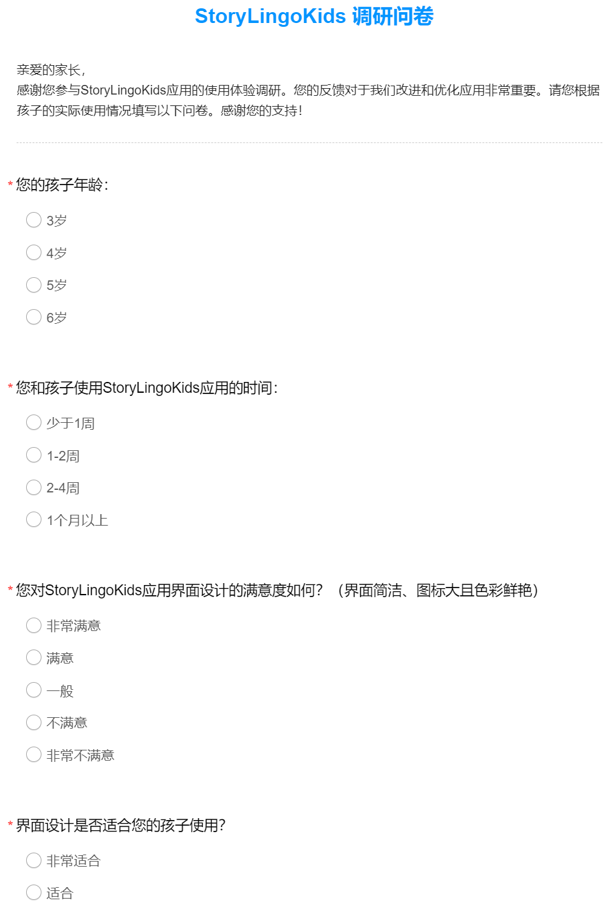

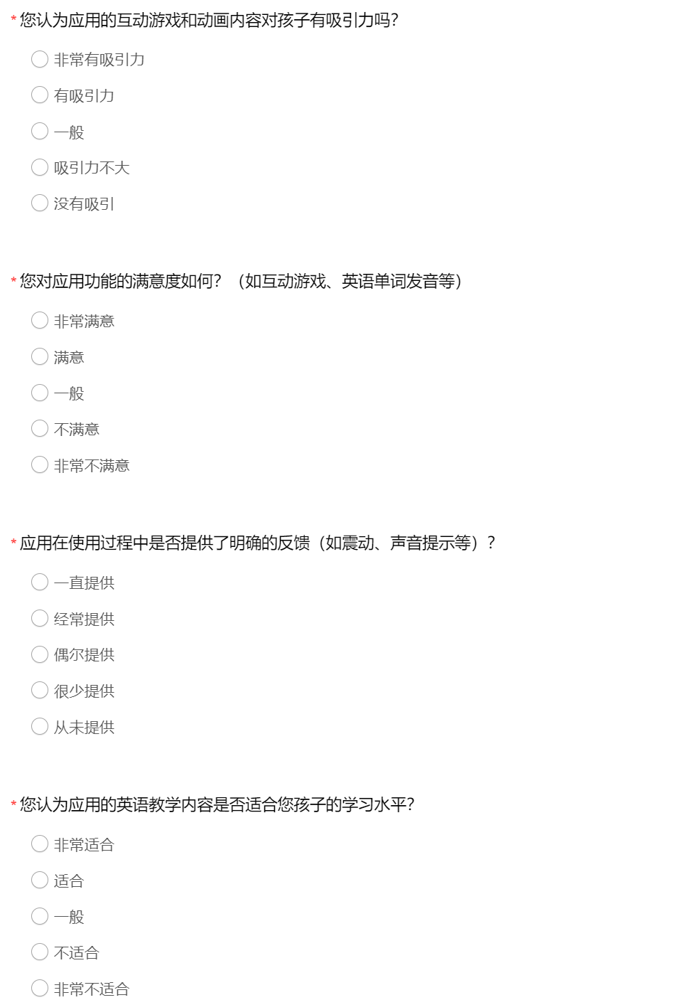

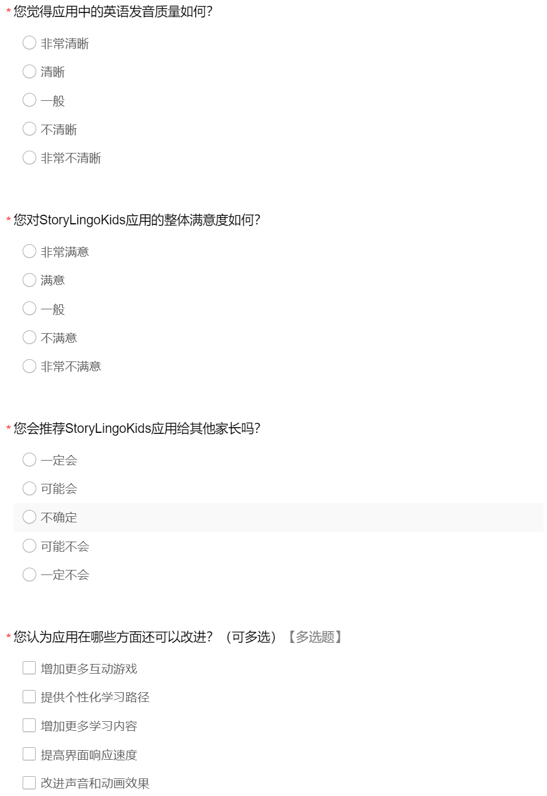

### 7.2 问卷结果分析

#### 7.2.1 界面设计

* **满意度高**：数据显示，90% 的家长对应用的界面设计表示非常满意或满意（50% 非常满意，40% 满意）。这表明 StoryLingoKids 在界面设计上成功吸引了家长和孩子的兴趣，满足了他们对简洁、直观界面的需求。
* **适用性强**：85% 的家长认为界面设计非常适合或适合他们的孩子使用（45% 非常适合，40% 适合），仅有 15% 的家长认为一般。这反映出应用界面的视觉和操作设计非常符合 3 至 6 岁幼儿的认知水平和操作能力。

#### 7.2.2 功能实用性

* **互动性吸引力强**：90% 的家长认为应用的互动游戏和动画内容对孩子有吸引力（55% 非常有吸引力，35% 有吸引力）。这说明应用的互动设计成功激发了孩子们的学习兴趣。
* **高功能满意度**：90% 的家长对应用功能表示非常满意或满意（50% 非常满意，40% 满意），这表明 StoryLingoKids 的功能设计和实现符合用户的需求。
* **明确反馈机制**：90% 的家长确认应用在使用过程中一直或经常提供明确的反馈（60% 一直提供，30% 经常提供）。这表明多感官反馈机制（如震动、声音提示和视觉动画）在提升用户操作确认感和学习动机方面起到了积极作用。

#### 7.2.3 内容适宜性

* **内容适用性高**：90% 的家长认为应用的教学内容非常适合或适合他们孩子的学习水平（50% 非常适合，40% 适合）。这表明 StoryLingoKids 的教学内容设计符合 3 至 6 岁幼儿的认知发展需求。
* **清晰的英语发音**：90% 的家长认为应用中的英语发音质量非常清晰或清晰（60% 非常清晰，30% 清晰）。这表明高质量的音频素材在帮助幼儿正确学习英语发音方面发挥了重要作用。

#### 7.2.4 整体体验

* **高满意度**：90% 的家长对 StoryLingoKids 应用的整体体验表示非常满意或满意（55% 非常满意，35% 满意），仅有 10% 的家长认为一般。这表明应用在整体用户体验上取得了很高的认可。
* **推荐意愿强**：90% 的家长表示他们一定会或可能会推荐 StoryLingoKids 应用给其他家长（60% 一定会，30% 可能会）。这反映出用户对应用的信任度和满意度较高，有助于推动市场推广。

#### 7.2.5 改进建议

* **增加互动游戏**：50% 的家长建议增加更多互动游戏，这表明家长希望通过更多的互动内容进一步提升孩子的学习兴趣和效果。
* **个性化学习路径**：40% 的家长希望提供个性化学习路径，这反映了家长对定制化教育体验的需求，期待应用能够根据孩子的学习进度和兴趣调整内容。
* **丰富学习内容**：35% 的家长建议增加更多学习内容，这显示出用户希望应用能提供更丰富的教育资源。
* **界面响应速度**：20% 的家长建议提高界面响应速度，表明在性能优化方面还有提升空间。
* **改进声音和动画效果**：15% 的家长建议改进声音和动画效果，这意味着在多媒体内容上仍有改进余地。

### 7.3 评估结果

#### 7.3.1 界面设计评估

* **简洁直观**：孩子和家长一致认可界面的直观性和适宜性，图标、色彩和布局都符合幼儿的视觉及操作习惯。我们的界面设计简单，功能布局清晰，几乎不依赖文字，而是通过图形和符号传达信息。
* **视觉吸引力**：在孩子使用应用时，注意到他们对一些图片展示出了极大的兴趣，并进一步探索，表明可爱的插画和动画，配以温暖柔和的配色成功吸引了孩子的注意力并激发他们的学习兴趣。

#### 7.3.2 功能设计评估

* **功能响应性**：交互设计提供多感官反馈，如触觉震动、声音提示和视觉动画，这些互动在使用过程中均正常运行。
* **教育内容**：孩子们基本能够辨认出图片内容和教学内容，说明设置的教育资源符合幼儿的认知水平和学习需求。内容通过互动活动呈现，既富有趣味性，又具有教育意义。

#### 7.3.3 内容适宜性评估

* **音频质量**：音频素材有趣准确，保证了发音的标准性和清晰度，吸引并帮助孩子正确学习英语发音。
* **互动性**：内容设计具有高度互动性，通过互动化的学习方式，孩子们的学习兴趣明显提高。

#### 7.3.4 改进方向

* **增加互动游戏**：家长建议增加更多互动游戏，以进一步提升孩子的学习兴趣和效果。我们将开发更多基于故事、角色扮演和问题解决的互动游戏，使学习过程更加有趣和多样化。
* **提供个性化学习路径**：根据孩子的学习进度和兴趣提供个性化的学习内容和路径，帮助孩子在自己的节奏中学习。我们将引入 AI 技术，分析孩子的学习行为，推荐适合的学习内容和活动。
* **丰富学习内容**：增加更多教育资源，如自然科学、社会知识等，扩展孩子的知识面。我们将与教育专家合作，开发更多丰富且有趣的学习内容。

### 7.4 优劣分析

#### 7.4.1 优势分析

* **跨平台功能**：利用 Flutter 开发，StoryLingoKids 能够在多种操作系统上运行，包括 Android 和 iOS，这样可以覆盖更广泛的用户群体。
* **丰富的交互设计**：应用提供多样的互动元素如动画、游戏和音频反馈，这些都是为了增强儿童的学习兴趣和提升用户体验设计的。
* **易用的用户界面**：界面设计考虑到儿童的操作习惯，使用大按钮和鲜艳的颜色，简化的导航，并且没有广告使得即使是年幼的孩子也能轻松使用。
* **教育内容多样化**：提供免费的从字母学习到故事阅读等多种教育模块，涵盖语言学习的多个方面，满足孩子的启蒙学习需要。

#### 7.4.2 劣势分析

* **市场竞争压力大**：教育应用市场竞争激烈，许多有强大资金和技术支持的大公司也在开发类似产品，对 StoryLingoKids 构成压力。
* **功能复杂度有限**：相比市场上一些成熟的教育应用，StoryLingoKids 在某些功能的深度和复杂度上可能不足，如个性化学习路径和高级教育分析功能。
* **用户数据利用不足**：目前尚未充分利用用户行为数据来优化学习体验或进行产品迭代，这是一个未充分挖掘的潜力区域。

## 8 项目展望

StoryLingoKids 在现有的基础上，不仅通过高质量的界面设计、丰富的功能和适宜的教育内容获得了用户的高度评价，同时还具有很强的扩展性，为未来的发展奠定了坚实的基础。尽管目前由于时间限制尚未全部实现，但我们已经为未来的发展预留了发展空间。

1. **扩展多语言支持**：我们计划在未来版本中引入多语言支持，预留了多语言支持的接口，使 StoryLingoKids 不仅仅局限于英语启蒙教育，还可以帮助孩子们学习其他语言，如西班牙语、法语、汉语等。

3. **个性化学习路径**：我们计划引入个性化学习路径，通过 AI 技术分析孩子们的学习行为和进度，推荐最适合的学习内容和活动。这一功能将极大提升学习效果，帮助孩子在自己的节奏中高效学习。StoryLingoKids 支持未来扩展 AI 接口，只需进一步的算法开发和数据集成。

4. **增强现实（AR）技术**：为提升学习的互动性和趣味性，我们计划在未来版本中引入增强现实（AR）技术，让孩子们在现实环境中进行互动学习。这不仅可以增强学习体验，还可以帮助孩子更好地理解抽象概念。

## 文档更新日期

2024年6月17日